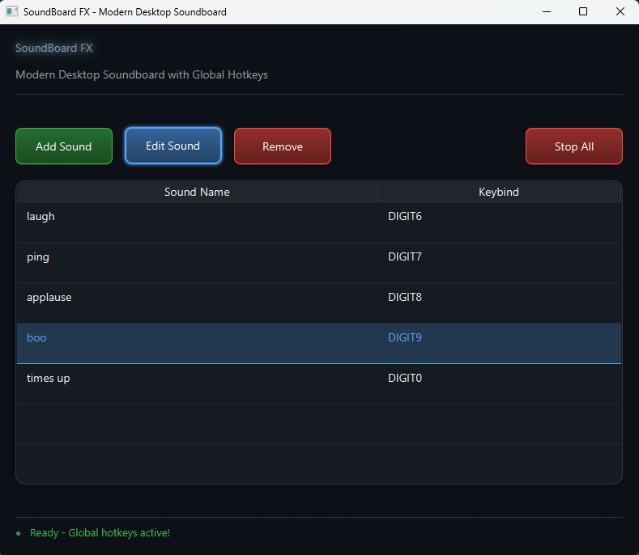

# 🎶 SoundBoard FX

A modern JavaFX desktop soundboard application for Windows 11 with keybind support, sound management, and a sleek user interface.

## ✨ Features

- 🎨 **Modern UI**: Clean, Windows 11-inspired design with smooth animations
- 📂 **Sound Import**: Support for MP3, WAV, M4A, and AAC audio files
- 🎹 **Keybind Support**: Assign custom keyboard shortcuts to sounds (supports combinations like CTRL+SHIFT+A)
- 🛠 **Sound Management**: Add, edit, and remove sounds with an intuitive interface
- 💾 **Persistent Configuration**: Automatically saves your soundboard setup
- 🔊 **Multi-sound Playback**: Play multiple sounds simultaneously or stop all at once
- 🖱 **Double-click to Play**: Quickly test sounds by double-clicking table rows

## 📋 Requirements

## 📸 Screenshots

### GUI


- ☕ **Java 17** or higher
- 🖥 **JavaFX 19** (included as Maven dependency)
- 📦 **Maven 3.6+** for building
- 🪟 **Windows 11** (optimized for, but should work on other platforms)

## 🗂 Project Structure

```
soundboardfx/
├── src/main/java/com.maven.soundboard.soundboardfx/
│   ├── App.java                    # Main application class
│   ├── SoundBoardController.java   # UI controller and logic
│   ├── SoundItem.java              # Data model for sounds
│   ├── SoundManager.java           # Sound playback management
│   └── ConfigManager.java          # Configuration persistence
├── src/main/resources/
│   ├── soundboard.fxml            # UI layout definition
│   └── styles.css                 # Modern UI styling
├── src/test/java/com.maven.soundboard.soundbardfx/
└── pom.xml                        # Maven configuration
```

## ⚙️ Setup and Installation

### 1️⃣ Clone/Setup Project
Ensure your project structure matches the layout above.

### 2️⃣ Place Files
Copy all the provided Java files into your `src/main/java/com.maven.soundboard.soundboardfx/` directory.

Create a `resources` folder at `src/main/resources/` and place:
- `soundboard.fxml`
- `styles.css`

### 3️⃣ Build and Run
```bash
# Navigate to project directory
cd soundboardfx

# Clean and compile
mvn clean compile

# Run the application
mvn javafx:run
```

## 🎛 Usage

### ➕ Adding Sounds
1. Click the **"Add Sound"** button
2. Enter a name for your sound
3. Click **"Browse"** to select an audio file
4. 🎹 Click in the keybind field and press your desired key combination
5. Click **"Add"** to save

### ⌨️ Supported Keybinds
- 🔑 Single keys: `A`, `F1`, `SPACE`, etc.
- 🖇 Combinations: `CTRL+A`, `SHIFT+F1`, `CTRL+SHIFT+SPACE`, etc.
- ⚡ Modifiers: CTRL, ALT, SHIFT

### ▶️ Playing Sounds
- ⌨️ **Keybinds**: Press the assigned key combination anywhere in the application
- 🖱 **Double-click**: Double-click any sound in the table
- 🎶 **Multiple sounds**: Can play simultaneously

### 🛠 Managing Sounds
- ✏️ **Edit**: Select a sound and click **"Edit Sound"**
- 🗑 **Remove**: Select a sound and click **"Remove"**
- ⏹ **Stop All**: Click **"Stop All"** to halt all playing sounds

## 💾 Configuration

The application automatically saves your soundboard configuration to:
```
%USERPROFILE%/.soundboardfx/sounds.json
```

This file contains all your sound names, file paths, and keybinds.

## 🐛 Troubleshooting

### ❗ JavaFX Module Issues
If you encounter module-related errors, run with:
```bash
mvn javafx:run -Dargs="--add-opens java.base/java.lang=ALL-UNNAMED"
```

### 🔇 Sound Files Not Playing
- ✅ Ensure audio files exist at the specified paths
- 🎧 Check that files are in supported formats (MP3, WAV, M4A, AAC)
- 🔊 Verify your system audio is working

### 🏗 Build Issues
- ☕ Confirm you're using Java 17+
- 📦 Ensure Maven 3.6+ is installed
- 🔄 Try `mvn clean install` to resolve dependencies

## 👨‍💻 Development

### ➕ Adding New Features
The codebase is modular and well-structured for extensions:

- 🎵 **SoundItem**: Add new properties to the data model
- 🎶 **SoundManager**: Extend audio playback capabilities
- 💾 **ConfigManager**: Modify persistence behavior
- 🖥 **SoundBoardController**: Add UI functionality
- 🎨 **styles.css**: Customize the appearance

## 📜 License

This project is open source. Feel free to modify and distribute as needed.
